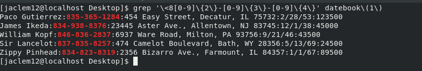
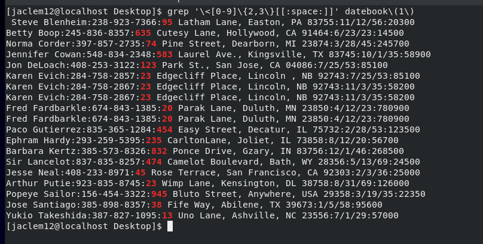

# <a href="https://Jaclem.github.io/index">Python</a> | <a href="https://Jaclem.github.io/c programming">C Programming</a> | Linux
---

## Problem
Print all lines where the phone number is in an are code that starts with an 8 only using grep

To get this answer I used Regular Expressions 

I found 2 seperate ways of coming up with this answer

## Problem
Print lines where the address begins with a two or three digit number

