# <a href="https://Jaclem.github.io/index">Python</a> | SQL | <a href="https://Jaclem.github.io/c programming">C Programming</a> | <a href="https://Jaclem.github.io/linux">Linux</a>
---

## Problem
A murder mystery style game created by https://mystery.knightlab.com/ to test some SQL skills and below is the synopsis

"A crime has taken place and the detective needs your help. The detective gave you the crime scene report, but you somehow lost it. 
You vaguely remember that the crime was a murder that occurred sometime on Jan.15, 2018 and that it took place in SQL City. 
Start by retrieving the corresponding crime scene report from the police department’s database."

First I searched through the "crime_scene_report" database to find any murders that occured on the 15th of 2018

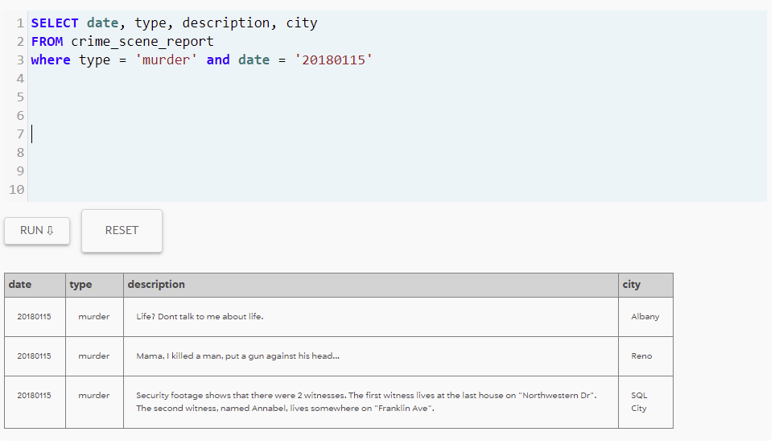

Found out the First Witness lives at the last house on “Northwestern DR”
And the second Witness Named Annabel, lives somewhere on “Franklin Ave”

Found the second witness Annabel and her ID: 16371 

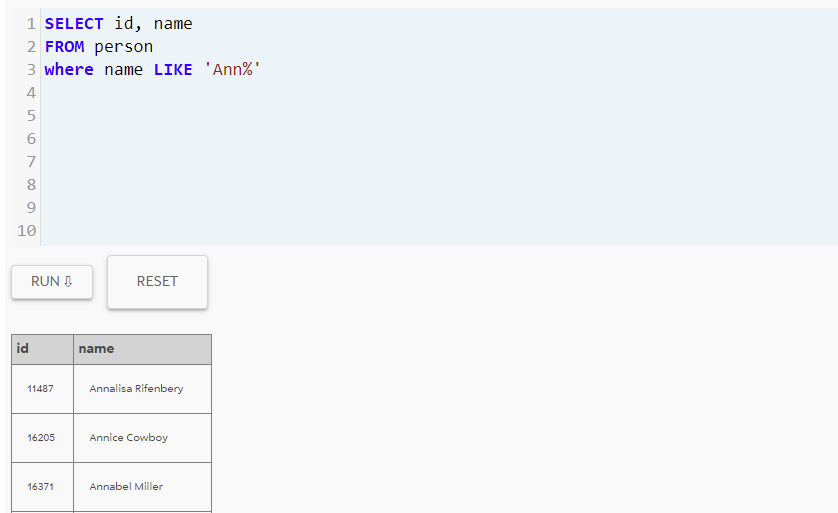

I found the transcript by searching Annabel's ID in the "interview" database 

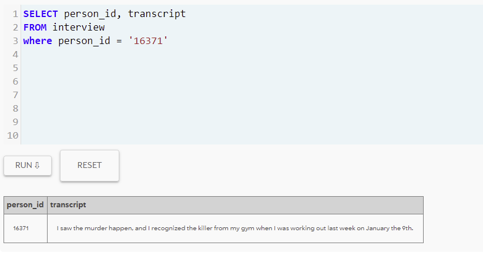

I was able to create a match for potential suspects by joining the id tables 
from “get_fit_now_check_in” and “get_fit_now_member” and joining only those that checked in with the date of January 9th

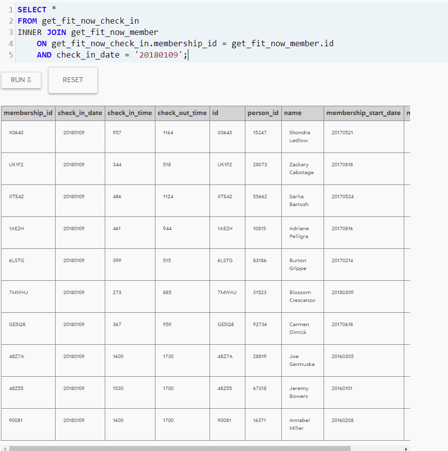

From here I went and found witness #2 by using the database "person" to find the last house on “Northwestern Dr” with the MAX() function
on the "address_number" table

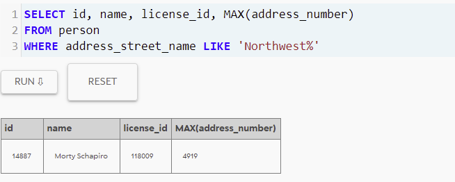

I then used the ID number of Morty to search his interview and now have more of a lead on the case

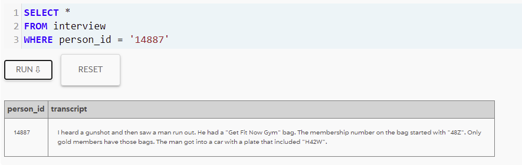

I used the old join that I created earlier to join the gym ID and date as well as the membership ID to get 2 possible suspects.

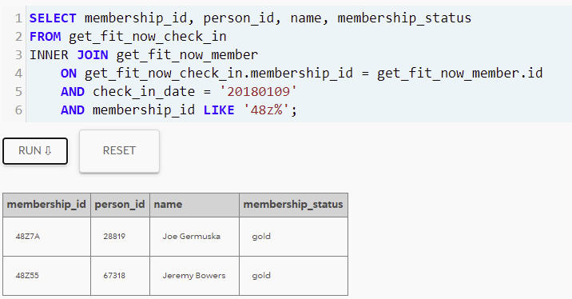

I joined the databases "person", "drivers_license", and "get_fit_now_member" to match up the Membership ID as well as the license plate number 
from “drivers_license” to match up the main suspect/murderer Jeremy Bowers

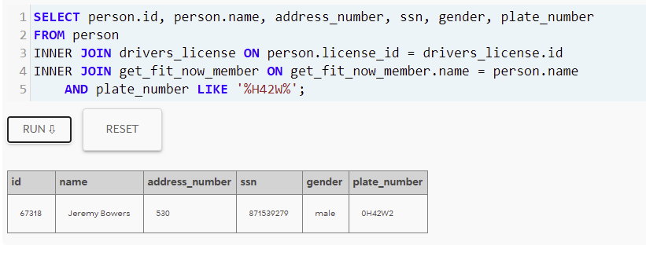

Proof I found the right person

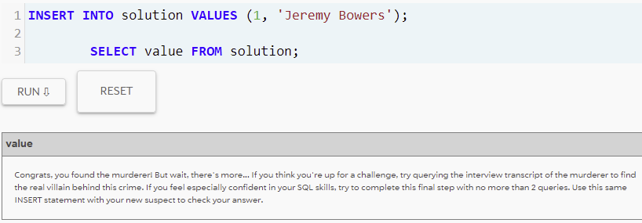

Bonus question was to find more information about who else was involved so I did a quick search of the "interview" database using Jeremy's ID

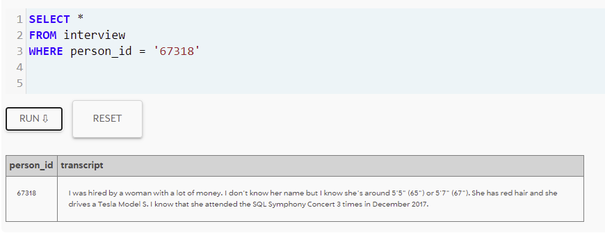

After getting the information from Jeremy’s Transcript I used that information and created a query that joined "person", "drivers_license", 
and "facebook_event_checkin" to match up the hair color, gender, car make and model to find who had gone to the symphony concert 3 times in December. 
This gave me Miranda Priestly who was the person who hired Jeremy.

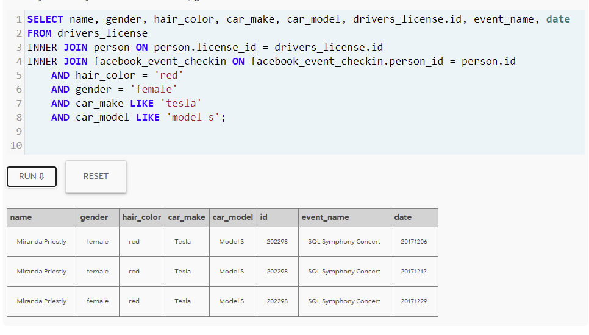
